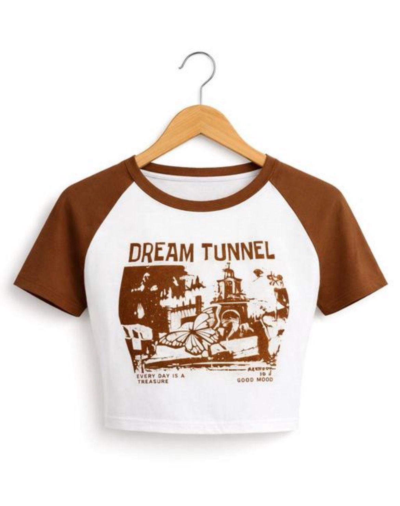
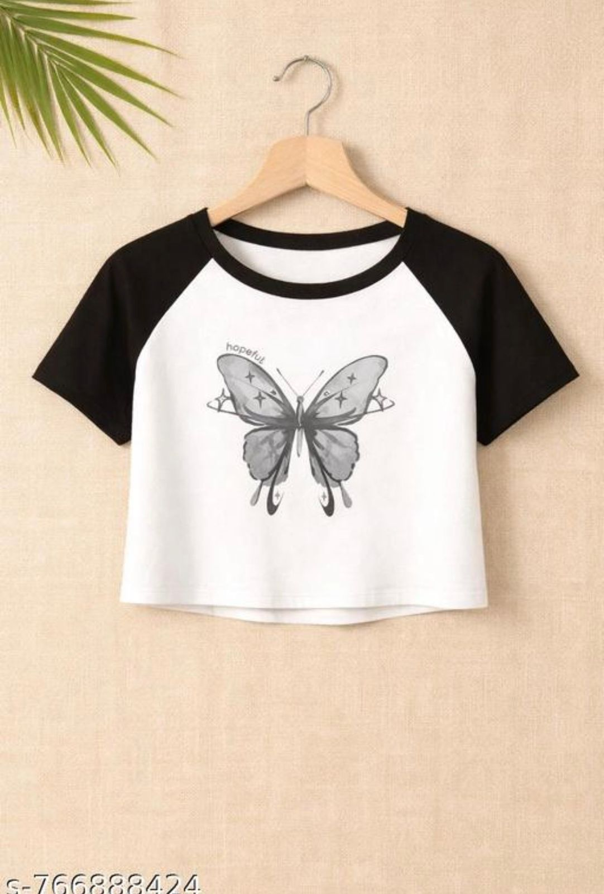

<!DOCTYPE html>
<html>
<head>
    <title>AV Brothers Fashion & Clothing</title>
    <meta name="viewport" content="width=device-width, initial-scale=100">

    
</head>

<body>

<header>
    <h1>AV Brothers Fashion & Clothing</h1>
    
Fena Gaon, Kamatghar, Bhiwandi

<input type="text" placeholder="Search product..." onkeyup="searchProduct(this.value)">
<input type="text" id="search" placeholder="Search product..." onkeyup="filterProduct()">

<select onchange="filterProduct()" id="category">
  <option value="all">All</option>
  <option value="top">Top</option>
  <option value="kurti">Kurti</option>
</select>
</header>

<h2>Our Products</h2>

<!-- Product 1 -->

<h3>Stylish Collar Girls Top</h3>

Price: ₹199

<a href="payment.html"><button>Explore</button></a>

<!-- Product 2 -->

<h3>Ribbed V-Neck Crop Top (White)</h3>

Price: ₹299

<a href="payment.html"><button>Explore</button></a>

<!-- Product 3 -->

<h3>Trending Crop Top (White)</h3>

Price: ₹199

<a href="payment.html"><button>Explore</button></a>

<!-- Product 4 -->

<h3>Stylish Party Wear Top</h3>

Price: ₹199

<a href="payment.html"><button>Explore</button></a>

    <h2>Contact</h2>
    
Phone: +91 7248906682

    
Location: Fena Gaon, Kamatghar, Bhiwandi

<footer>
    © 2026 AV Brothers Fashion & Clothing
</footer>

</body>
</html>
